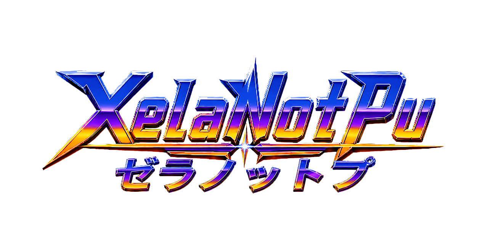

<p align="center">
  
</p>

# Sony ZN-1 for MiSTer — Release 2026-07-17

FPGA implementation of the Sony **ZN-1** arcade board for the
[MiSTer platform](https://github.com/MiSTer-devel/Main_MiSTer/wiki).

The ZN-1 (1995) is a PlayStation-based arcade platform: an R3000A-compatible
MIPS CPU, a PSX-type GPU (CXD8561) with 2 MB VRAM, and main RAM — paired with
ZN-specific hardware that has no consumer-PlayStation equivalent: a
per-manufacturer boot ROM in place of a PS1 kernel, banked game ROM in place of
a CD drive, **CAT702** challenge/response security chips, per-manufacturer
NVRAM/EEPROM, and manufacturer sound and I/O sub-boards. This core implements
the ZN-1 base hardware and the boot ROMs, security and banking for five of the
board's licensees: **Visco, Tecmo, Taito (FX-1), Atlus, and Raizing/Eighting**.

The core is derived from the excellent
[PSX_MiSTer](https://github.com/MiSTer-devel/PSX_MiSTer) core by **Robert Peip
(FPGAzumSpass)**, which provides the CPU, GPU, GTE, DMA, and memory-subsystem
foundation.

## Supported games
| Game | Licensee / BIOS | Status |
|---|---|---|
| **Dead or Alive ++** (Japan/USA Export) | Tecmo — `coh1002m` | **Playable** — full-colour attract, character roster, and in-game all render correctly (headline title) |
| **Aero Fighters Special** (USA) | Visco — `coh1002v` | **Playable** — attract, character select, gameplay |
| **Logic Pro Adventure** (Japan) | Tecmo — `coh1002m` | **Playable** — full-colour title and puzzle play |
| **1 on 1 Government** (Japan) | Tecmo — `coh1002m` | **Playable** — attract / demo play (slow first boot ~75 s while it initialises backup RAM) |
| **Brave Blade** (World) | Raizing — `coh1002e` | **Playable** — attract, shooter gameplay |
| **Bloody Roar** (Japan) | Raizing — `coh1002e` | **Playable** — attract ("ROARING") and gameplay |
| **G-Darius Ver.2** (2.03J) | Taito FX-1B — `coh1002t` | **Playable** — attract and gameplay; **sound effects only, no music** (see Known issues) |
| **G-Darius** (2.01J) | Taito FX-1B — `coh1002t` | **Playable** — attract and gameplay; SFX only |
| **G-Darius** (2.02O) | Taito FX-1B — `coh1002t` | **Playable** — full attract (new in this release: bank-register bit fix); SFX only |
| **Psychic Force** (2.4O) | Taito FX-1A — `coh1000t` | **Playable** — full attract; SFX only |
| **Monster Farm Jump** (Japan) | Tecmo — `coh1002m` | **Playable** — full attract, ranking, gameplay demo (new in this release) |
| **Tondemo Crisis** (Japan) | Tecmo — `coh1002m` | **Playable** — 3D attract, in-game scenes, title (new in this release) |
| **Tecmo World Cup Millennium** (Japan) | Tecmo — `coh1002m` | **Playable** — 3D lineup, live demo match, stadium attract (new in this release) |
| **Gallop Racer 2** (Japan/Export) | Tecmo — `coh1002m` | **Playable** — records, live 3D racing attract (new in this release) |
| **Gallop Racer 3** (Japan/Export) | Tecmo — `coh1002m` | **Playable** — paddock, live 3D racing, rankings (new in this release) |
| **Shanghai Matekibuyuu** (Japan) | Tecmo — `coh1002m` | **Playable** — attract and gameplay |
| **The Block Kuzushi** (Japan) | Tecmo — `coh1002m` | **Playable** — attract and gameplay |
| **Flame Gunner** (Export) | Tecmo — `coh1002m` | **Playable** — attract and gameplay |
| **Sonic Wings Limited** (Japan) | Visco — `coh1002v` | **Playable** — attract and gameplay |
| **Super Football Champ** (2.5O) | Taito FX-1A — `coh1000t` | Boots to test/config menu (first-boot NVRAM init) |
| **Fighters' Impact** (2.02O) | Taito FX-1B — `coh1002t` | Boots — if the OSD "Test Mode" is on, the game shows its service menu (leave it via the menu's EXIT item or a core Reset; toggling Test Mode off alone doesn't exit) |
| **Magical Date** (2.02J) | Taito FX-1A — `coh1000t` | Boots — FX-1A EEPROM path (shared with Psychic Force) |
| **Ray Storm** (2.06A) | Taito FX-1B — `coh1002t` | **Boots** — ROM self-test now passes (fixed in this release); first boot lands in the setup/test menu (settings don't persist yet — FRAM is volatile); SFX only |
| **Bloody Roar 2** (World) | Raizing — `coh1002e` | **Not yet** — EEPROM gate fixed this release (MRA preload); engine now runs at 60 fps but its asset loader stalls partway, before the title (under investigation) |
| **Heaven's Gate** (Atlus) | Atlus — `coh1001l` | **Not yet** — passes BIOS security, uploads assets, then freezes before first render (GPU/DMA completion path, under investigation) |

**Full romset coverage**: every ZN-1 romset supported by these five licensees
has an MRA in this release — one primary per game in `_Arcade/`, with
regional/revision alternates under `_Arcade/_alternatives/_<Game>/`. The
alternates are generated from the ROM definitions and, unless noted above, have
**not** each been individually boot-tested.

Capcom ZN-1 (`coh1000c`), Psikyo, and other licensees are **out of scope** for
this release (not yet implemented).

## Contents

```
RELEASE-20260717/
├── README.md
├── release/                       ← copy onto your MiSTer SD card
│   └── _Arcade/
│       ├── <one primary .mra per game>
│       ├── _alternatives/
│       │   └── _<Game>/           ← regional / revision alternates
│       └── cores/
│           └── ZN1_20260717.rbf   ← the FPGA core bitstream
├── source/                        ← full FPGA core source (build it yourself)
│   ├── art/  rtl/  sys/  mra/  pause_src/
│   ├── ZN1.qpf  ZN1.qsf  ZN1.sdc  ZN1.sv  files.qip
│   └── LICENSE  COPYING.GPL2  COPYING.GPL3
└── art/                           ← README artwork
```

## Installation

1. Copy `release/_Arcade/` to the `_Arcade/` folder on your MiSTer SD card
   (merging with what is already there).
2. Place your own ROM zips in the MiSTer arcade ROM location
   (`games/mame/` or `_Arcade/mame/`).
3. Select a game from the arcade menu.

The `.mra` files reference the core as `ZN1`; MiSTer picks the newest dated
`ZN1_*.rbf` in `_Arcade/cores/`.

## Hardware requirements

A standard MiSTer with a **32 MB SDRAM module** is sufficient. ZN-1 banked game
ROM is staged in SDRAM; the largest sets (32 MB banked ROM) fit within a 32 MB
module.

## ROM zips required

No ROMs are included. Each MRA references MAME romsets by zip name, and every
game also needs its **manufacturer boot-ROM zip**, loaded at runtime:

| Licensee | Boot-ROM zip | Example games |
|---|---|---|
| Tecmo | `coh1002m.zip` | Dead or Alive ++, Logic Pro Adventure, 1 on 1 Government |
| Visco | `coh1002v.zip` | Aero Fighters Special, Sonic Wings Limited |
| Taito FX-1A | `coh1000t.zip` | Psychic Force, Super Football Champ, Magical Date |
| Taito FX-1B/1Z | `coh1002t.zip` | G-Darius, Ray Storm, Fighters' Impact |
| Atlus | `coh1001l.zip` | Heaven's Gate |
| Raizing / Eighting | `coh1002e.zip` | Brave Blade, Bloody Roar, Bloody Roar 2 |

Alternates: each alternate MRA declares its own clone zip with a fallback to
the parent, so a merged parent zip satisfies every alternate of that game.

## Display & pause options

The OSD (P1 → Video & Audio) exposes a **Rotate** screen-flip and a **Pause
Screen** orientation (Horizontal / Vertical). For vertical (TATE) titles such as
Brave Blade, set **Pause Screen = Vertical** so the pause overlay's logo and
credits read in the same orientation as the game; the **Rotate** toggle then
selects which way (90° / 270°). Horizontal titles are unaffected.

## Known issues

- **Vertical pause-screen centering.** With Pause Screen = Vertical the overlay
  reads in the correct orientation, but its logo/text centering is not yet
  pixel-perfect on every resolution — a cosmetic refinement for a later build.
- **No music on Taito FX-1 titles.** The Taito Zoom / MN10200 sound
  co-processor is not emulated; G-Darius, Ray Storm, etc. play **sound effects
  only**. This is expected in this release.
- *(Fixed in this release)* **Ray Storm**'s "ROM R-3 ERROR" is resolved — a
  leftover diagnostic in earlier cores overwrote 32 bytes of banked ROM after
  loading. The game now passes its self-test; first boot lands in its
  setup/test menu (exit it with the controller; settings don't yet persist
  across power cycles because the FRAM is volatile in this release).
- **Bloody Roar 2** no longer hangs at the BIOS colour bars (its EEPROM now
  preloads with valid contents). Its engine now runs — but the asset loader
  stalls partway through, before the title screen (the original Bloody Roar
  works; investigation continues).
- **Heaven's Gate** passes the BIOS and loads its assets but freezes before
  drawing its first frame (a GPU/DMA completion wait; it is the only ZN-1
  title using the 368-pixel-wide display mode — under investigation).
- *(Fixed in this release)* The former Tecmo boot-stall group — Monster Farm
  Jump, Tondemo Crisis, Tecmo World Cup Millennium, Gallop Racer 2 — now boots
  and plays: the core delivers the SIO0 completion interrupt with real-hardware
  latency at the fast baud these games' security drivers use.
- *(Fixed in this release)* The `2.02O` G-Darius freeze-after-asset-load is
  resolved (the core decoded a spurious bit of the Taito bank register that
  only 2.02O sets).
- **First boot can be slow** (~75 s) for titles that initialise backup
  RAM/EEPROM on a blank NVRAM; subsequent boots are faster.

## No copyrighted data

This release contains **no game ROMs and no copyrighted game data**:

- The core bitstream embeds no boot ROM, no game data, and no captured NVRAM.
  Manufacturer boot ROMs are loaded at runtime from their `coh*.zip`; EEPROM/FRAM
  initialise blank and self-configure.
- The `.mra` files reference romsets by name only — they contain no inline ROM
  data.
- The `source/` tree contains the original FPGA logic, the standard PSX_MiSTer
  base RTL, hardware algorithm tables (CAT702), and the author's own
  pause-overlay artwork — no game/BIOS/firmware images.

## License

The core and its source are Free Software, conveyed under the **GNU General
Public License v3 or later** (the tree mixes GPLv2-or-later and GPLv3-or-later
files, so the combination is GPLv3+; every file remains available under the
terms in its own header). Full texts ship in `source/COPYING.GPL2` and
`source/COPYING.GPL3`.

This core derives from **PSX_MiSTer** by Robert Peip (FPGAzumSpass) and the
**MiSTer framework**; the ZN-1 board support (per-manufacturer boot ROM,
CAT702 security, ROM banking, NVRAM/EEPROM/FRAM) is an independent
re-implementation developed with reference to the MAME project's hardware
documentation.

## Legal

No ROMs. This repository contains no game ROMs and no copyrighted game data, and it provides no links or instructions for obtaining them. To use this core you must supply your own ROM dumps, made from original hardware or media that you legally own, where and to the extent your local law permits.

Trademarks. "Sony", "PlayStation", "ZN-1", and "ZN-2" are trademarks of Sony Interactive Entertainment Inc. The Sony ZN-1 arcade platform was licensed to and marketed by numerous manufacturers and publishers under their own arcade sub-brands; their company names, arcade-board brands, game titles, characters, and logos are trademarks or registered trademarks of their respective owners, including without limitation:

- **Capcom** (Capcom Co., Ltd.) — the ZN-1 / ZN-2 sub-brand
- **Tecmo** (Koei Tecmo Games Co., Ltd.) — the "TPS" sub-brand
- **Taito** (Taito Corporation, a Square Enix Group company) — the "FX-1" sub-brand
- **Video System** (Video System Co., Ltd.) and **Visco** (Visco Corporation)
- **Atlus** (Atlus Co., Ltd., a Sega Group company)
- **Eighting / Raizing** (Eighting Co., Ltd.)
- **Psikyo** (Psikyo Co., Ltd.)
- **Namco** (Bandai Namco Entertainment Inc.), whose System 11 / System 12 arcade boards share the same Sony ZN chassis
- **Acclaim Entertainment**, **Atari Games / Midway**, **Hudson Soft**, **Sunsoft (Sun Corporation)**, and other publishers and rights holders of ZN-1 titles

Game titles referenced in this release — including Dead or Alive, 1 on 1 Government, Gallop Racer, Monster Farm Jump, Tecmo World Cup, Flame Gunner, The Block Kuzushi and Tondemo Crisis (Tecmo); G-Darius, RayStorm, Psychic Force, Fighters' Impact, Super Football Champ and Magical Date (Taito); Aero Fighters / Sonic Wings (Video System); Brave Blade and Bloody Roar (Eighting/Raizing); Heaven's Gate (Atlus); and Shanghai Matekibuyuu (Sunsoft) — are trademarks of their respective owners.

This project is not affiliated with, endorsed by, or sponsored by Sony Interactive Entertainment or any of the companies or rights holders named above. All such names are used here in a purely nominative and descriptive manner, solely to identify the hardware and software being re-implemented or referenced.

Purpose. This is an independent, non-commercial hardware-preservation and interoperability project. The FPGA logic is an original re-implementation of the ZN-1 board's behavior, developed from observation and from publicly available documentation and references (including the MAME project's hardware documentation); it contains no proprietary source code from the original manufacturers.

Security-chip emulation. ZN-1 boards used CAT702 chips as a protection measure. This core re-implements that logic for interoperability and preservation, in the same manner as MAME and comparable FPGA cores. The CAT702 is a small challenge/response algorithm rather than stored key data, so no manufacturer key material is embedded in the bitstream. Laws such as the U.S. DMCA §1201 address circumvention of technological protection measures; whether and how they apply to this kind of preservation/interoperability use can depend on your jurisdiction and circumstances. Users are responsible for their own compliance.

User responsibility. Users are solely responsible for ensuring that their use of this core — including the acquisition and use of any ROM images — complies with copyright law and all other applicable laws in their jurisdiction.

No warranty. In accordance with the GPL license: THIS PROGRAM IS PROVIDED "AS IS" WITHOUT WARRANTY OF ANY KIND, EITHER EXPRESSED OR IMPLIED, INCLUDING, BUT NOT LIMITED TO, THE IMPLIED WARRANTIES OF MERCHANTABILITY AND FITNESS FOR A PARTICULAR PURPOSE. THE ENTIRE RISK AS TO THE QUALITY AND PERFORMANCE OF THE PROGRAM IS WITH YOU. IN NO EVENT WILL ANY COPYRIGHT HOLDER OR CONTRIBUTOR BE LIABLE TO YOU FOR DAMAGES, INCLUDING ANY GENERAL, SPECIAL, INCIDENTAL OR CONSEQUENTIAL DAMAGES ARISING OUT OF THE USE OR INABILITY TO USE THIS PROGRAM, EVEN IF ADVISED OF THE POSSIBILITY OF SUCH DAMAGES.
